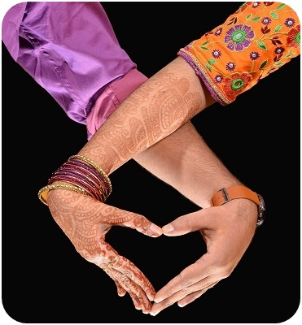
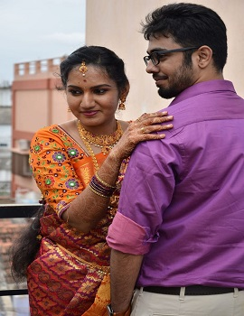

<!doctype html>

<html class="no-js" lang="en">

<head>

    <meta charset="utf-8">
    <meta http-equiv="x-ua-compatible" content="ie=edge">
    <meta name="viewport" content="width=device-width, initial-scale=1">
    <!--Theme Title-->
    <title>Wedding Invitation</title>

    <!-- Place favicon.ico in the root directory -->
    <link rel="shortcut icon" type="image/x-icon" href="favicon.png">

    <link rel="apple-touch-icon" href="favicon.png">
    <!-- All css Here -->

    <!-- All plugins css -->
    <link rel="stylesheet" href="assets/css/allplugins.css">
    <!-- Style css -->
    <link rel="stylesheet" href="assets/style.css">
    <!-- Responsive css -->
    <link rel="stylesheet" href="assets/css/responsive.css">

    <!-- Customization css -->
    <!--If u need any change then use this css file-->
    <link rel="stylesheet" href="assets/css/custom.css">
    <!-- Modernizr JavaScript -->

    
    <!-- HTML5 shim and Respond.js for IE8 support of HTML5 elements and media queries -->

    <!-- WARNING: Respond.js doesn't work if you view the page via file:// -->

    
    
    
</head>

<body oncontextmenu="return false">
    <!-- preloader Start -->
    

        

        

    

    <!--Slider area start here-->
    <section section-scroll='0' class="slider-area">
        

            

                

                    

                        

                            

                                

                                    

                                        

                                            

                                                

                                                    Save the
                                                        Date
                                                    <em class="wow animated fadeInUp"
                                                        data-wow-duration="2.5s">24/10/2021</em>
                                                

                                                <h2 class="wow animated fadeInDown" data-wow-duration="1s">Krish
                                                    & Sree
                                                </h2>
                                                
ARE GETTING
                                                    MARRIED!

                                            

                                        

                                    

                                

                            

                        

                        

                            

                                

                                    

                                        

                                            

                                                

                                                    Save the
                                                        Date
                                                    <em class="wow animated fadeInUp"
                                                        data-wow-duration="2.5s">24/10/2021</em>
                                                

                                                <h2 class="wow animated fadeInDown" data-wow-duration="1s">Krish
                                                    & Sree
                                                </h2>
                                                
ARE GETTING
                                                    MARRIED!

                                            

                                        

                                    

                                

                            

                        

                        

                            

                                

                                    

                                        

                                            

                                                

                                                    Save the
                                                        Date
                                                    <em class="wow animated fadeInUp"
                                                        data-wow-duration="2.5s">24/10/2021</em>
                                                

                                                <h2 class="wow animated fadeInDown" data-wow-duration="1s">Krish
                                                    & Sree
                                                </h2>
                                                
ARE GETTING
                                                    MARRIED!

                                            

                                        

                                    

                                

                            

                        

                    

                

            

        

    </section>

    <!--Slider area End here-->

    <!--About area start here-->

    <section section-scroll='1' class="about_area section section-bg">
        

            

                

                    

                        <figure>
                        </figure>
                        

                            <h2>Krishnaraj </h2>

                        

                    

                

                

                    

                        <h2>Invitation</h2>
                        
We inviting you and your family on

                        Sunday
                        <h3>24 Oct 2021</h3>
                        
At S.A.K Bharath Mahal, Palayapalayam, Erode

                    

                    

                        <figure></figure>
                    

                

                

                    

                        <figure>
                        </figure>
                        

                            <h2> Sreedevi</h2>

                        

                    

                

            

        

    </section>

    <!--About area End here-->

    <!--Counter area start here-->

    <section class="counter-area section bg-img jarallax">
        

            

                

                    

                        
We Are Waiting For...

                        <h2>The Adventure</h2>
                    

                

                

                    

                        <ul>

                            <li>00
                                
Days

                            </li>

                            <li>00
                                
hours

                            </li>

                            <li>00
                                
minutes

                            </li>

                            <li>00
                                
seconds

                            </li>

                        </ul>

                    

                

            

        

    </section>

    <!--Counter area End here-->

    <!--Event area start here-->

    <section section-scroll='3' class="event-area section section-bg">
        

            

                

                    

                        <h2>The Wedding Event</h2>
                    

                

            

            

                

                    

                        <h2> Reception </h2>
                        <h3>Save the date</h3>
                        <button style="color: white; background-color: crimson;">23 Oct 2021</button>
                        <button style="color:crimson; background-color:white;">6:00 pm</button>
                        <h3>At S.A.K Bharath Mahal, Erode</h3>
                    

                

                

                    

                        <figure>
                            
                        </figure>
                    

                

                

                    

                        <h2> Muhurtham</h2>
                        <h3> Save the date</h3>
                        <button style="color: white; background-color: crimson;">24 Oct 2021</button>
                        <button style="color:crimson; background-color:white;">9 am - 10.30 am</button>
                        <h3>At S.A.K Bharath Mahal, Erode</h3>
                    

                

            

        

    </section>

    <!--Event area End here-->

    <!--Banner area start here-->

    <section class="banner-area section sm-img af">
        

            

                

                    

                        <h2>We are going to...
                            Celebrate
                            Our Love.</h2>
                         
                        

                            <h3>Join us in celebrating love, laughter and the beginnings of a  marvelous new chapter!
                            </h3>
                        

                    

                

            

        

    </section>
    <!--Banner area end here-->

    <!--Contact area start here-->

    <section section-scroll='7' class="contact-area section section-bg">
        

            

                

                    

                        
<iframe class="gmap_iframe" width="100%" height:420px frameborder="0"
                                scrolling="no" marginheight="0" marginwidth="0"
                                src="https://maps.google.com/maps?width=600&amp;height=400&amp;hl=en&amp;q=S.a.kBharath mahal &amp;t=&amp;z=14&amp;ie=UTF8&amp;iwloc=B&amp;output=embed"></iframe>

                        
                    

                

                

                    

                        

                            

                            

                                <h2>Location</h2>
                                
S.A.K. Bharath Mahal,  Palayapalayam, Erode 

                            

                        

                        

                            

                            

                                <h2>Contact</h2>
                                
Groom
                                    &nbsp;&nbsp;&nbsp;&nbsp;&nbsp;&nbsp;&nbsp;&nbsp;&nbsp;&nbsp;&nbsp;&nbsp;&nbsp;&nbsp;&nbsp;&nbsp;
                                    +91
                                    87787 45737

                                
Groom's Dad &nbsp;&nbsp;&nbsp; +91 82200 37727

                                
Groom's Mom &nbsp;&nbsp; +91 88704 41900

                            

                        

                    

                

            

        

    </section>
    <!--Contact area end here-->

    <!--Gallery area start here-->

    <section section-scroll='10' class="gallery-area section2 bg-img jarallax af">
        

            

                

                    

                        <h2>Engagement Photoshoot</h2>
                    

                

            

            

                

                    

                        

                            <figure>
                                <a href="assets/images/gallery/1.jpg"><i class="fas fa-search"></i></a>
                            </figure>
                        

                    

                    

                        

                            <figure>
                                <a href="assets/images/gallery/2.jpg"><i class="fas fa-search"></i></a>
                            </figure>
                        

                    

                

                

                    

                        

                            <figure>
                                <a href="assets/images/gallery/5.jpg"><i class="fas fa-search"></i></a>
                            </figure>
                        

                    

                    

                        

                            <figure>
                                <a href="assets/images/gallery/6.jpg"><i class="fas fa-search"></i></a>
                            </figure>
                        

                    

                

                

                    

                        

                            <figure>

                                <a href="assets/images/gallery/9.jpg"><i class="fas fa-search"></i></a>

                            </figure>

                        

                    

                    

                        

                            <figure>

                                <a href="assets/images/gallery/10.jpg"><i class="fas fa-search"></i></a>

                            </figure>

                        

                    

                

                

                    

                        

                            <figure>

                                <a href="assets/images/gallery/13.jpg"><i class="fas fa-search"></i></a>

                            </figure>

                        

                    

                    

                        

                            <figure>

                                <a href="assets/images/gallery/14.jpg"><i class="fas fa-search"></i></a>

                            </figure>

                        

                    

                

            

        

    </section>

    <!--Gallery area end here-->

    <!-- All JavaScript Here -->
    <!-- jQuery latest version -->
    
    <!-- Bootstrap Core JavaScript -->
    
    <!-- Owl.carousel JavaScript -->
    
    <!-- Bxslider JavaScript -->
    
    <!-- Magnific Popup JavaScript -->
    
    <!-- meanmenu JavaScript -->
    
    <!-- jarallax JavaScript -->
    
    <!-- jQuery-ui JavaScript -->
    
    <!-- Progressbar Animation JavaScript -->
    
    <!-- masonry JavaScript -->
    
    <!-- wow JavaScript -->
    
    <!-- Plugins JavaScript -->
    
    <!-- Init JavaScript -->
    
    
    

</body>

</html>
